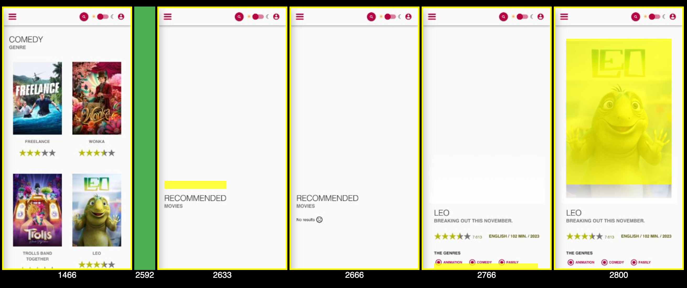

# Soft Navigation Trace Viewer

## Overview
This project creates filmstrip views from traces using the experimental new [Soft Navigation API](https://developer.chrome.com/docs/web-platform/soft-navigations-experiment) in Chrome.

Here is an example of what it displays:

It highlights:
* The start of the soft navigation in green (hover for more info)
* The paints which were LCP candidates in yellow (hover for more info)
* The timestamps of paints along the bottom (in milliseconds from when the recording started)

## Try it out
To use it, you need to record a trace of one or more soft navigations:
1. Enable [experimental web platform features](https://developer.chrome.com/docs/web-platform/chrome-flags#two_other_ways_to_try_out_experimental_features):
   1. Type chrome://flags/#enable-experimental-web-platform-features into the urlbar
   2. Ensure "Experimental Web Platform features" is enabled
   3. Restart Chrome for the change to take effect
2. Load the page you want to trace and open devtools.
3. Test to ensure soft navigations are detected; in the console you should see "A soft navigation has been detected: <url>" if the page's soft navigations are properly detected.
4. Open the performance panel and press record. See ["Record runtime performance"](https://developer.chrome.com/docs/devtools/performance#record) in the devtools "Analyze runtime performance" guide for more information.
5. Do one or more soft navigations on the page.
6. Press stop on the performance panel and wait for it to process the recording.
7. Download the recording using the "Save profile" button with the down arrow icon.
8. Open `soft-navigation-trace-viewer.html` in a browser and drop the JSON file into it. You can [use the version hosted on glitch](https://soft-navigation-timeline.glitch.me/) if you don't want to run it locally.
9. A filmstrip should appear showing the navigations and largest contentful paint candidates. You can use the "Save Page As" feature to save this filmstrip and share it.
