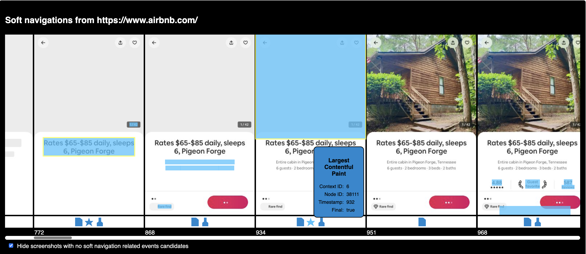

# Soft Navigation Trace Viewer

## Overview
This project creates filmstrip views from traces using the experimental new [Soft Navigation API](https://developer.chrome.com/docs/web-platform/soft-navigations-experiment) in Chrome.

Here is an example of what it displays:

It highlights:
* When a new soft navigation context is created (via a user click/keypress), with a **cursor arrow** icon. If a URL change, DOM modification, or paint is part of this soft navigation it should be associated with the context. The arrow and all the events in the context will be show in the same color. You can hover or click on their icon for details.
* When a DOM modification occurs in the soft nav context, with a **page with turned corner** icon. The hover tooltip shows a full list of DOM nodes modified. Their node ids can be mapped to paint events.
* When there is a paint in one of the aforrementioned nodes, with a **paintbrush icon**. Rectangles showing the locations of the paints will be drawn on the filmstrip. Largest Contenful Paint candidates will be highlighted on the filmstrip with a yellow border. Hovering over the icon or the paint rectangles will show a tooltip with more information.
* When a URL update and enough paints have occured to detect a soft navigation, with an **indicator arrow** icon. You can hover for details, including the URL.
* When an LCP candidate appears, with a **star icon**. If the candidate is the final LCP candidate, it will be shown in a lighter color. Hover for a tooltip with more information.
* When the context is exhausted, with an **hourglass icon**. It's normal for these not to occur before tracing ends, or all of the contexts to be exhausted at once at the end of page load.

## Try it out
To use it, you need to record a trace of one or more soft navigations:
1. Use Chrome M139 Beta or Chrome M140 Dev/Canary or later.
2. Start Chrome with the command line flags `--enable-features=SoftNavigationHeuristics:mode/advanced_paint_attribution,NavigationId`
3. Open DevTools. Ensure you've enabled recording all trace events (this will help the team with diagnosing any unexpected bugs):
    * In DevTools, click the settings gear icon.
    * Click "Experiments" in the left sidebar.
    * Scroll down to "Unstable Experiments"
    * Check the "Performance panel: show all events" box.
    * You'll need to reload devtools.
4. Open the DevTools performance panel and start recording.
5. Interact with the page, doing the soft navigations you want to debug, and waiting for the content to paint.
6. Stop the recording.
7. Click the download button and save the trace.
8. Upload it to https://trace.cafe/
9. Click "Soft-Nav" at the upper right. You can see the filmstrip now!
10. To share or add to a bug, just copy the trace.cafe URL from the URLbar.

If you don't have a trace recorded and you just want to see what it does, you can use the [Example Trace](ExampleTraceUnformatted.json).